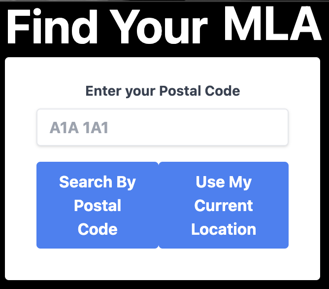
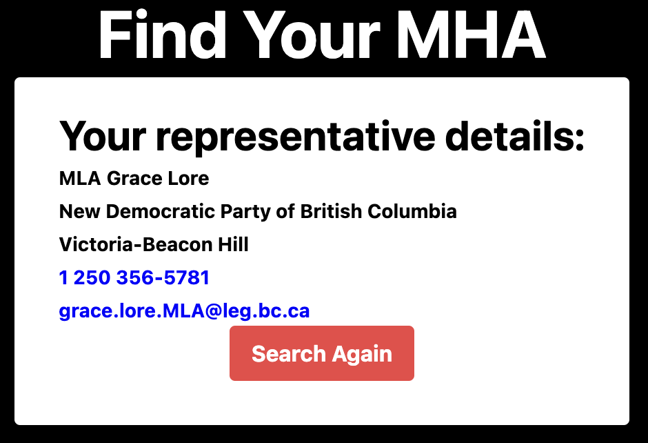

<a name="readme-top"></a>

[![LinkedIn][linkedin-shield]][linkedin-url]

<div align="center">
<h3 align="center">Find My MLA</h3>

  <p align="center">
    Helping Canadian Citizens find their MLA, MPP, MNA, or MHA.
    <br />
    <a href="https://github.com/brysonbest/findmymla"><strong>Explore the docs »</strong></a>
    <br />
    <br />
    <a href="https://github.com/brysonbest/findmymla">View Demo</a>
    ·
    <a href="https://github.com/brysonbest/findmymla/issues">Report Bug</a>
    ·
    <a href="https://github.com/brysonbest/findmymla/issues">Request Feature</a>
  </p>
</div>

<!-- TABLE OF CONTENTS -->
<details>
  <summary>Table of Contents</summary>
  <ol>
    <li>
      <a href="#about-the-project">About The Project</a>
      <ul>
        <li><a href="#built-with">Built With</a></li>
      </ul>
    </li>
    <li>
      <a href="#getting-started">Getting Started</a>
      <ul>
        <li><a href="#prerequisites">Prerequisites</a></li>
        <li><a href="#installation">Installation</a></li>
      </ul>
    </li>
    <li><a href="#usage">Usage</a></li>
    <li><a href="#roadmap">Roadmap</a></li>
    <li><a href="#contributing">Contributing</a></li>
    <li><a href="#license">License</a></li>
    <li><a href="#contact">Contact</a></li>
    <li><a href="#acknowledgments">Acknowledgments</a></li>
  </ol>
</details>

<!-- ABOUT THE PROJECT -->

## About The Project




Find My MLA is an application that helps Canadian citizens find their MLA, MPP, MNA, or MHA. The application uses the postal code of the user to search for their representative, or allows a user to find their representative based on their current location. The application will return the name, party, and contact information for the representative.

<p align="right">(<a href="#readme-top">back to top</a>)</p>

### Built With

This application was developed to be as basic as possible for easy troubleshooting and re-use of the project. Some styling has been done with <a href="https://tailwindcss.com/">tailwindcss</a>, and developed and run using <a href="https://vitejs.dev/">Vite.js</a>.

<p align="right">(<a href="#readme-top">back to top</a>)</p>

<!-- GETTING STARTED -->

## Getting Started

To get a local copy up and running follow these simple example steps.

### Prerequisites

- npm
  ```sh
  npm install npm@latest -g
  ```

### Installation

1. Clone the repo
   ```sh
   git clone https://github.com/brysonbest/findmymla.git
   ```
2. Install NPM packages
   ```sh
   npm install
   ```

<p align="right">(<a href="#readme-top">back to top</a>)</p>

<!-- USAGE EXAMPLES -->

## Usage

Use this application to search for Canadian MLA's, MPP's, MNA's, or MHA's. The application will return the name, party, and contact information for the representative. This is a not-for-profit project intended to aid citizens with finding their representatives.

## Disclaimer

The application is not intended to be used for any other purpose. Information is not vetted prior to dissemination, and may be inaccurate. Please go to your provincial website for the most up-to-date information. The application is not affiliated with any government body. Any actions taken based on the information provided by this application are the sole responsibility of the user.

<p align="right">(<a href="#readme-top">back to top</a>)</p>

<!-- ROADMAP -->

## Roadmap

See the [open issues](https://github.com/brysonbest/findmymla/issues) for a full list of proposed features (and known issues).

<p align="right">(<a href="#readme-top">back to top</a>)</p>

<!-- CONTRIBUTING -->

## Contributing

Contributions are what make the open source community such an amazing place to learn, inspire, and create. Any contributions you make are **greatly appreciated**.

If you have a suggestion that would make this better, please fork the repo and create a pull request. You can also simply open an issue with the tag "enhancement".
Don't forget to give the project a star! Thanks again!

1. Fork the Project
2. Create your Feature Branch (`git checkout -b feature/AmazingFeature`)
3. Commit your Changes (`git commit -m 'Add some AmazingFeature'`)
4. Push to the Branch (`git push origin feature/AmazingFeature`)
5. Open a Pull Request

<p align="right">(<a href="#readme-top">back to top</a>)</p>

<!-- LICENSE -->

## License

Distributed under the MIT License. See `LICENSE.txt` for more information.

<p align="right">(<a href="#readme-top">back to top</a>)</p>

<!-- CONTACT -->

## Contact

Project Link: [https://github.com/brysonbest/findmymla](https://github.com/brysonbest/findmymla)

<p align="right">(<a href="#readme-top">back to top</a>)</p>

<!-- ACKNOWLEDGMENTS -->

## Acknowledgments

- [Geocoder.ca](https://geocoder.ca/) Provided the API used to accurately search using postal code information.
- [Represent Civic Information API](https://represent.opennorth.ca/) Provided the API used to search for representatives based on location.

<p align="right">(<a href="#readme-top">back to top</a>)</p>

<!-- MARKDOWN LINKS & IMAGES -->

[linkedin-shield]: https://img.shields.io/badge/-LinkedIn-black.svg?style=for-the-badge&logo=linkedin&colorB=555
[linkedin-url]: https://linkedin.com/in/bryson-best
